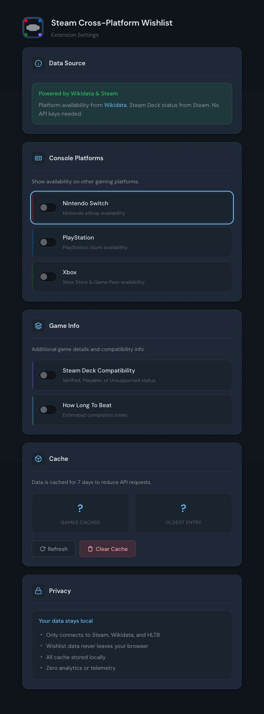

# Steam Cross-Platform Wishlist

> See which Steam wishlist games are available on Nintendo Switch, PlayStation, Xbox, and Steam Deck — plus completion times from How Long To Beat.


<!-- TODO: Add Chrome Web Store badge once published -->
<!-- [](https://chrome.google.com/webstore/detail/EXTENSION_ID) -->

## The Problem

You're browsing your Steam wishlist and wondering:
- "Is this on Switch? I'd rather play it portable..."
- "How long will this game take to finish?"
- "Does this work on my Steam Deck?"

**This extension answers those questions instantly.**

## Features

### Platform Availability Icons

Colored icons appear next to each game showing availability:
- **Nintendo Switch** — Opens Nintendo eShop
- **PlayStation** — Opens PlayStation Store
- **Xbox** — Opens Xbox Store / Game Pass

Click any icon to go directly to that platform's store page.

### Steam Deck Compatibility

See Valve's official Steam Deck Verified status:
- **Bright icon** — Verified (works great)
- **Dimmed icon** — Playable (may need tweaks)

### How Long To Beat Integration

Completion time estimates from HowLongToBeat.com:
- See main story, main + extras, or completionist times
- Hover for full breakdown
- Click to view on HLTB

### Customizable



Toggle each feature on/off:
- Enable/disable individual platforms
- Choose which HLTB stat to display
- Manage local cache

## Installation

### Chrome Web Store (Recommended)

*Coming soon — extension is pending review*

### Manual Installation (Developers)

```bash
git clone https://github.com/YOUR_USERNAME/cross-platform-steam-wishlist
cd cross-platform-steam-wishlist
npm install && npm run build
```

1. Open `chrome://extensions/`
2. Enable "Developer mode"
3. Click "Load unpacked"
4. Select the project folder

## How It Works

1. Extracts game info from your Steam wishlist page
2. Queries [Wikidata](https://www.wikidata.org) for platform availability (community-maintained open data)
3. Uses Steam's native data for Steam Deck verification status
4. Queries [HowLongToBeat](https://howlongtobeat.com) for completion time estimates
5. Caches results locally for 7 days (fast on repeat visits)
6. Displays icons and badges next to each game

## Privacy

**This extension respects your privacy:**

| What we DON'T do | What we DO |
|------------------|------------|
| No accounts required | Cache data locally |
| No analytics/tracking | Query Wikidata for platforms |
| No telemetry | Query HLTB for game lengths |
| No wishlist data transmitted | Validate store URLs work |

**Host permissions explained:**

| Domain | Purpose |
|--------|---------|
| `store.steampowered.com` | Read wishlist, inject icons |
| `query.wikidata.org` | Platform availability data |
| `howlongtobeat.com` | Completion time estimates |
| `store.playstation.com` | Validate PS store links |
| `www.nintendo.com` | Validate Nintendo links |
| `www.xbox.com` | Validate Xbox links |

All cached data stays in `chrome.storage.local` — never sent anywhere else.

## FAQ

**Q: Why doesn't [game] show a Nintendo icon?**
Platform data comes from Wikidata, a community-edited database. Some games may not have complete platform information yet. You can [contribute to Wikidata](https://www.wikidata.org) to add missing data.

**Q: The HLTB time seems wrong**
HLTB matches by game name. Some games with common names may match incorrectly. Click the badge to verify on HLTB.

**Q: Icons disappeared after a Steam update**
Steam occasionally changes their page structure. The extension handles most changes automatically. If issues persist, try refreshing the page or clearing the extension cache in settings.

## Development

```bash
npm install          # Install dependencies
npm run build        # Compile TypeScript to dist/
npm run test:unit    # Run unit tests
npm run typecheck    # Type check without emitting
```

### Project Structure

```
src/
├── content.ts       # DOM manipulation, icon injection
├── background.ts    # Service worker, message routing
├── resolver.ts      # Orchestrates cache/API lookups
├── wikidataClient.ts    # Wikidata SPARQL queries
├── hltbClient.ts    # How Long To Beat API
├── steamDeckClient.ts   # Steam Deck SSR data
├── cache.ts         # chrome.storage wrapper
├── options.html/ts  # Settings page
├── popup.html/ts    # Quick settings popup
└── types.ts         # Type definitions
```

### Regenerating Marketing Assets

```bash
./scripts/regen-marketing.sh
```

See [assets/marketing/RUNBOOK.md](assets/marketing/RUNBOOK.md) for details.

## Contributing

Issues and pull requests welcome. Please read the existing code style before contributing.

## License

[Apache 2.0](LICENSE)

---

**Not affiliated with Valve, Nintendo, Sony, Microsoft, or HowLongToBeat.**
