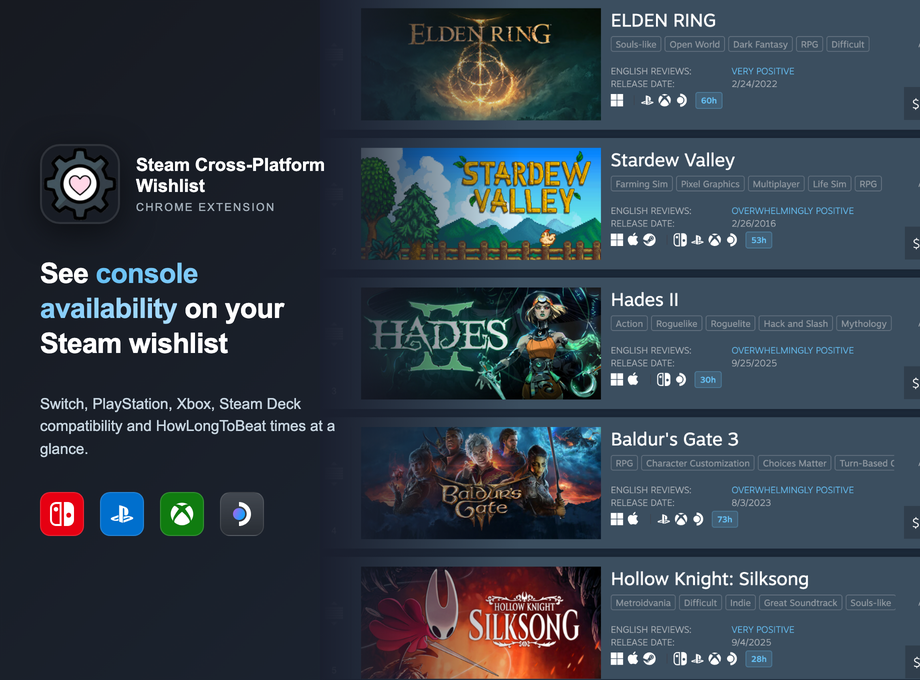

# Steam Cross-Platform Wishlist

[](LICENSE)
[](https://github.com/user/steam-cross-platform-wishlist/releases)
[]()

Shows which Steam wishlist games are also on Switch, PlayStation, Xbox, or Steam Deck. Plus HowLongToBeat times.



## Why?

Steam's wishlist doesn't show platform availability. Checking manually means clicking through 4 storefronts per game. This extension does that lookup automatically using Wikidata (free, crowd-sourced) and shows icons inline.

**Not Augmented Steam** — this focuses purely on cross-platform availability. No price history, no tracking, no telemetry. ~50KB, runs entirely client-side.

Built because I got tired of checking 4 storefronts manually. Open source because cross-platform info shouldn't require a subscription.

**Philosophy:** One tool, one job. No feature creep, no cloud sync, no accounts. Your wishlist data stays in your browser.

## Install

```bash
npm i && npm run build
```

Then `chrome://extensions` → Developer mode → Load unpacked → select this folder.

No backend. Everything runs client-side with a 7-day cache.

**Requirements:** Chrome 88+ (MV3). Firefox/Edge not supported yet.

## Features

- **Cross-platform icons** — Nintendo Switch, PlayStation, Xbox, Steam Deck status at a glance
- **Completion times** — HowLongToBeat data inline (when their API cooperates)
- **Direct store links** — Click any icon to jump to that platform's store page
- **No backend** — Runs entirely client-side with 7-day cache
- **No telemetry** — Wikidata queries only, nothing phoned home

### vs. Augmented Steam

| | This extension | Augmented Steam |
|--|----------------|-----------------|
| Platform availability | ✓ | ✗ |
| HowLongToBeat times | ✓ | ✓ |
| Price history | ✗ | ✓ |
| Size | ~50KB | ~5MB |
| Telemetry | None | None |

Different tools for different needs. This one does one thing.

## How it works

| Source | What | Catch |
|--------|------|-------|
| Wikidata SPARQL | Platform availability | ~50% coverage (volunteer-maintained) |
| HLTB API | Completion times | Undocumented, breaks monthly |
| Steam SSR | Deck verified status | Requires page script injection¹ |

¹ MV3 content scripts can't access page JS context, so we inject `steamDeckPageScript.ts` to read `g_rgAppData`.

When HLTB breaks, times disappear but platform icons still work.

**Why Wikidata?** Free, no API key, anyone can fix bad data. The ~50% coverage gap is a data problem, not a code problem.

## Architecture

```
┌─────────────┐  message   ┌─────────────┐
│   content   │ ────────►  │  background │
│   script    │ ◄──────── │   worker    │
└──────┬──────┘  response  └──────┬──────┘
       │                          │
       ▼                          ▼
  DOM injection            ┌──────┴──────┐
  + page script            │   resolver  │
  (g_rgAppData)            └──────┬──────┘
                                  │
                    ┌─────────────┼─────────────┐
                    ▼             ▼             ▼
                 cache       wikidata        hltb
```

See [CLAUDE.md](CLAUDE.md) for full architecture details and dev workflow.

## Limitations

- **Wikidata**: ~50% of Steam games have platform data. You can [add missing games](https://www.wikidata.org/wiki/Wikidata:WikiProject_Video_games) yourself.
- **HLTB**: Fuzzy name matching fails on ~15% of titles (usually indies with weird names). No official API exists.
- **Rate limits**: 500ms delay between Wikidata queries to avoid getting throttled.

## Troubleshooting

- **Icons not showing?** Check DevTools console for `[XCPW` messages
- **Times missing?** HLTB API probably changed again. Check network tab on howlongtobeat.com
- **Wrong platform data?** Wikidata issue — anyone can fix it at [wikidata.org](https://www.wikidata.org/)

## Development

```bash
npm run build          # TypeScript → dist/
npm run test:unit      # Jest + coverage
npm run test:integration  # Full E2E (slow)
```

## Contributing

PRs welcome. A few ways to help:

1. **Add missing games to Wikidata** — most coverage gaps are data gaps
2. **Fix HLTB when it breaks** — reverse-engineer the new API format from network requests
3. **Add new platforms** — update `icons.ts` and `resolver.ts`

See [CLAUDE.md](CLAUDE.md) for architecture, test coverage requirements (80% minimum), and dev workflow.

## Acknowledgments

- [Wikidata community](https://www.wikidata.org/wiki/Wikidata:WikiProject_Video_games) for maintaining game platform data
- [HowLongToBeat](https://howlongtobeat.com/) for completion times (undocumented API, but it works)
- Valve for SSR data we read via page script injection

## License

Apache 2.0
